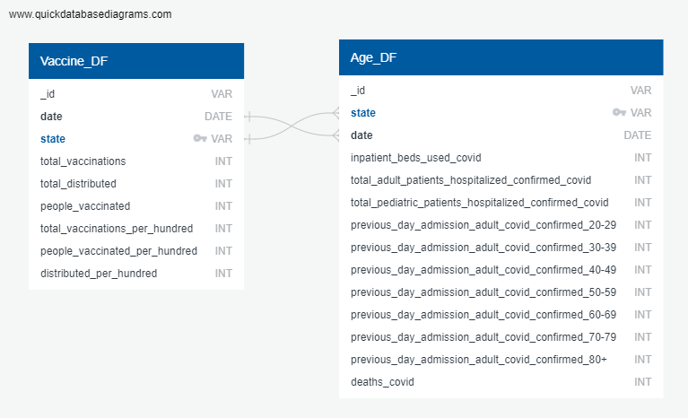

## project-3

Manjusha Sethi: msethi1025@gmail.com 
Danielle Danis: daniellemdanis@gmail.com
Rafael Soriano: sorianor131@gmail.com 
Kerigo Ndirangu: kgndirangu@gmail.com 

## Chosen Track: Data Engineering
## Chosen Topic: Healthcare (Covid-19 Vaccines)

## An overview of the project and its purpose

Project Statement: The aim of our project is to examine the effectiveness of vaccines using the Covid-19 vaccine as a case study. To create a database that can be used to examine the ongoing impact of Covid-19 vaccination on various included endpoints such as death and utilized to predict pattern of vaccine rollout and uptake for future epidemics. 

## Data Sources Used: 

- https://ourworldindata.org/us-states-vaccinations

- https://beta.healthdata.gov/Hospital/COVID-19-Reported-Patient-Impact-and-Hospital-Capa/g62h-syeh/data_preview

## Exploratory Questions:
- How many people were vaccinated each month starting from Jan 1st 2021 - Jan 1st 2022 in each state? 
- How many vaccines were available in each state? 

## Instructions on how to use and interact with the project

  Data Folder has following Data Sources:
- Raw Data:  1. Data/us_state_vaccinations.csv
             2. Data/COVID_Vaccines_ByAge.json
             3. Data/COVID-19_Reported_Impact_and_Hospital_by_State.csv

  Processed Data: Data/app.py

  Output Data has following:
- Cleaned Data in csv format: Output/Covid19_Data.csv
- Cleaned Data in json format: Output/Covid19_Data.json
- Output Data also has a Sample Javascript an shtml file as a sample of how above mentioned files can be used for Data visulaization.
- Data Extraction and Loading Code: CovidData_Setup_Starter.ipynb

## External Library Used: Fast API
- To launch our Covid-19 Vaccination Database python application, please visit https://fastapi.tiangolo.com/ for installation documentation

## Documentation of the database used and why
- We used MongoDB for following reasons
- Faced with a large amount of data where fields may be incomplete, MongoDB is capable of parsing data quickly 
- Data  came from multiple sources while using different formats so NoSQL was an efficient way to store it.
- Data is dynamic so we needed flexible schemas to make changes as requirements might change. 
- Also as new data continuously need to be integrated NoSQL was chosen.

## ETL workflow with diagrams or ERD

- Read data using python and pandas from multiple CSV files.
- Converted collections into pandas dataframe.
- Cleaned and structured data into desired form.
- Merged clean dataframes to create our final CSV output.
- Import final CSV output into MongoDB Atlas for storage.
- Use FastAPI to query the database.

## Selection of columns for final database
The selection of fields really depended on the type of analysis we wanted to perform. In our case the fields we kept focused on a subset of data that was relevant to our original objective wich was measuring the impact of covid vaccinations by state.

### Relevance to Vaccination Data
- The fields related to vaccinations (e.g. total vaccinations, people vaccinated) are included because our analysis was focused on tracking and understanding the vaccination progress over time and across different states. 

### Healthcare Impact
- Fields related to hospitalization data can provide insights into the impact of COVID 19 on healthcare systems. These metrics may be relevant if you are interested in understanding the strain on hospital resources. 

### Demographic Analysis
- The fields related to age specific admissions can be useful for demographic analysis, helping to identify trends and patterns in COVID 19 admissions across different age groups. 

### Mortality Data
- The deaths_covid field provides information on COVID 19 related deaths, which is crucial for understanding the severity and impact of the pandemic on mortality rates.

### Distribution Metrics
- Metrics such as total_distributed and distributed_per_hundred are included to understand the distribution of vaccines across states and the population coverage. 

## Ethical considerations made in the project
We tried to maintain our Ethichal Obligations while doing this project which are shown by following ethical considerations:

- 1. Transparency: We provided the source references. Our engineered data is on GitHub for open use.
- 2. Accountability: All the relevant data was included with consistency.
- 3. Privacy: No personal information was used.
- 4. Security:  Risks was mitigated while using Cloud MongoDB (no individual IP addresses, instead 00.00.00) .
- 5. Consent: Data used was from a open source. 
- 6. Integrity: Data was used from reliable sources.

  
